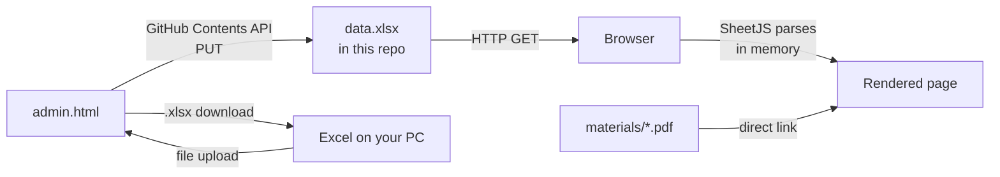

# Society Directory

A public, mobile-friendly directory for a housing society — committee, emergency numbers,
service contacts, residents and downloadable documents. It reads everything from a single
Excel file.

**Live:** https://hedaprateek.github.io/People-Information/
**Admin:** https://hedaprateek.github.io/People-Information/admin.html
(deliberately not linked from the public page — type the address)

---

## Where the data comes from

**There is no database.** `data.xlsx`, sitting next to `index.html` in this repository, *is*
the data store. The browser downloads it and parses it in memory on every page load.



The two lines that do it, in `index.html`:

```js
var DATA_FILE = "data.xlsx";
fetch(DATA_FILE + "?v=" + Date.now())   // ?v= defeats CDN caching
  .then(r => r.arrayBuffer())
  .then(b => XLSX.read(b, { type: "array" }));
```

Nothing is stored server-side, there is no API of our own, no accounts, and no session.
Every visitor gets the same file and renders it locally.

### Why there is no database

An earlier version used Supabase with row-level security and share tokens. It was removed
because a read-mostly directory of ~50 rows does not need a database, and the database
brought migrations, API keys, RLS policies and a token-based share model with it. Plain
files mean no credentials to leak, no service to keep alive, no monthly cost, and no vendor
lock-in — moving hosts is a two-minute reconnect.

That history is still in git if it is ever wanted: `git show 7d7c701`.

---

## External connections

These are every network call the site makes. There is no application backend.

| Host | Used by | Purpose | Required? |
|---|---|---|---|
| *(same origin)* `data.xlsx` | `index.html`, `admin.html` | The directory data | Yes |
| *(same origin)* `materials/*` | `index.html` | Document downloads | Only if you list documents |
| `cdn.sheetjs.com` | both | Reads and writes `.xlsx` in the browser | Yes |
| `fonts.googleapis.com`, `fonts.gstatic.com` | `index.html` | Space Grotesk + Inter | No — falls back to system fonts |
| `api.github.com` | `admin.html` | Commits `data.xlsx` and uploaded files | Only when you press Publish |
| `view.officeapps.live.com` | `index.html` | Opens Word/Excel/PowerPoint without downloading | Only for Office documents |

`api.github.com` is the only one that ever *writes*, it is only called from the admin page,
and only with a token you paste in yourself.

---

## How the spreadsheet maps to the page

**Every sheet tab becomes a section.** The tab name becomes the heading. Add a tab, get a
section. Rename a tab, rename the section.

| Sheet | Becomes |
|---|---|
| `About` | The page header — not a section (see below) |
| any tab containing **emerg** | Red **Emergency** panel in the sidebar |
| any tab with a **File** column | **Documents** panel in the sidebar |
| everything else | A contact section in the main column |

### The `About` sheet

Two columns, `Field` and `Value`:

| Field | Value |
|---|---|
| Society Name | Green Valley Residency |
| Tagline | A Co-operative Housing Society |
| Address | Plot 14, Sector 22, Kharghar |
| City | Navi Mumbai |
| Pincode | 410210 |
| Registration No | NBOM/HSG/1284/2009 |
| Logo | *(optional image URL)* |
| Photo | *(optional — a photograph behind the dashboard)* |

### A photograph behind the dashboard

The top of the page carries a faint building line — row houses on the left,
flats on the right — drawn rather than photographed, so it costs nothing to
load and works offline like everything else.

To use a real photograph of the society instead, put the file in `materials/`
and name it in `About`:

| Field | Value |
|---|---|
| Photo | materials/society.jpg |

`Backdrop`, `Hero image`, `Cover image` and `Banner` all work as the field
name. A full `https://` address is accepted too, though a file in the repo is
better — it is then cached for offline use with everything else.

The photograph is greyed and dropped to about a tenth of its strength. That is
not a style choice that can be turned up: the society's name, address and
section counts are read on top of it, and the level was set by measuring the
contrast of that text against the backdrop at its darkest. `test/contrast.test.mjs`
holds the ceiling and the measurements behind it.

A wide, calm picture works best — the building line, or the gate, shot from far
enough back. Anything busy turns to texture at that strength. Nothing that
identifies a resident should be in it; this page is served to every member and
the file sits in a public repository.

### Columns are matched by meaning

You do not have to rename your columns. Headings are matched case- and
punctuation-insensitively:

| Shown as | Headings that match |
|---|---|
| Card heading | `Name`, `Service`, `Person`, `Title`, `Label` — or the first column |
| Call button + number | `Phone`, `Mobile`, `Contact No`, `Cell`, `Tel`, `Number` |
| Email button | `Email`, `Mail` |
| Small grey label | `Role`, `Designation`, `Post`, `Type`, `Category`, `Position` |
| Sub-line | `Flat`, `Block`, `Wing`, `Tower`, `Unit`, `Floor`, `Address` |
| Document link | `File`, `Link`, `URL`, `Path`, `Attachment`, `Download` |
| Avatar photo | `Photo`, `Image`, `Picture`, `Avatar` (an image URL) |
| Charge badge (gold pill) | `Charges`, `Rate`, `Fee`, `Price`, `Cost`, `Amount` |
| Call + WhatsApp + Share buttons | any phone column (see **Sharing** below) |
| Unit-type chip on the sub-line | `Unit Type`, `Property Type`, `House Type`, `Residence Type`, `Dwelling` |
| Extra detail line | anything else |

Multiple phone columns each get their own number. Blank cells are skipped.

**`Unit Type` — when a wing and number repeat.** Many societies have a flat `B-11`
*and* a row house `B-11`. Put `Flat`, `Row House`, `Shop` or `Bungalow` in this column
and the two are told apart everywhere: a chip in front of the address on the card, and
— more importantly — a separate access code each. Without it the admin panel treats
them as one household, issues one code between them, and revoking one revokes both.
Leave the column blank wherever there is no ambiguity; a blank cell renders nothing.

Note that `Unit Type` and `Type` are different columns. `Type` is Owner/Tenant and
shows as the small grey label; `Unit Type` is the kind of home.

## How the page is laid out

The site is a set of places rather than one long scroll.

- **Home** is an index: one tile per sheet, each showing how many entries are inside.
  Nothing else — the emergency and documents panels live on their own pages, because on a
  phone the sidebar stacks above the main column and four emergency rows filled the screen
  before a single tile appeared.
- **Tapping a tile opens that section on its own**, with a back link to home. On a phone
  there is also a bottom tab bar — Home, then the emergency section, then the first few
  sections, capped at five.
- **Search cuts across everything.** Whatever section you are standing in, typing shows
  matches from every sheet at once; clearing the box returns you where you were.

Each section has its own address (`#residents`, `#services-help`), so a link to one can
be shared and the browser back button moves between sections.

---

## The public services page

`services.html` is the one page anyone can open **without an access code** — meant to be
shared around the town. It never names the society and has no link back into the
directory.

It reads `services.json`, which is built from the services sheet alone. **`data.xlsx` is
never exposed** — it carries the resident list, so a public page reading it would have
meant ungating everything. The Cloudflare gate opens for an exact set of paths
(`/services.html`, `/services.json`, the icons) and nothing else; a prefix rule would
quietly open whatever was dropped alongside them later.

| Sheet | Goes to |
|---|---|
| `Services & Help` | the directory **and** the public page |
| `_Town Services` | the public page **only** — the leading underscore keeps it off the directory |

So a trade can be listed for the whole town without appearing in the society's own
section. In the admin panel, **Public services page → Upload a separate list** takes an
Excel or CSV and loads it into `_Town Services`, asking whether to add or replace. It
needs a `Name` column; everything else is optional. **Download a blank list** gives you
the right headings to start from.

| Column | Does |
|---|---|
| `Name` | Required |
| `Category` | The section heading — Repairs & Maintenance, Home Help, Utilities |
| `Role` | The trade, which becomes a sub-heading inside the category |
| `Phone` | Call and WhatsApp buttons |
| `Covers` | Two or three words shown under the name: *small works*, *routine jobs*, the areas they serve. Optional |
| `Charges`, `Timings`, `Notes` | Shown when the row is tapped |

`Covers` also matches `Area`, `Areas`, `Serves`, `Speciality`, `Works`, `Summary` or `Info`.

Each contact is **one line** — name, trade, call and WhatsApp — and everything else opens
on a tap. Publishing from the admin writes `services.json` alongside `data.xlsx`, so the
town page cannot drift behind the directory.

Set `Services Page Title`, `Services Page Tagline` and `Services Page Theme`
(`civic`, `slate` or `paper`) in `About`. The society's own `Theme` is deliberately not
inherited — this page is meant to read as a different thing.

---

## Works offline, installs to the home screen

A service worker keeps the page, the spreadsheet, SheetJS and the fonts on the device.
Open the site once with a connection and it works without one afterwards — which is when
the plumber's number is actually wanted. On Android, Chrome offers an **Install** prompt;
on iPhone it is Share → Add to Home Screen. Installed, it opens without browser chrome
and has its own icon.

| File | Does |
|---|---|
| `sw.js` | The worker. Bump `VERSION` at the top to retire every old cache |
| `manifest.webmanifest` | Name, colours and icons for the installed app |
| `icons/` | Generated by `node scripts/make-icons.js` — no image editor needed |

`data.xlsx` and the page are fetched **network-first**, so a publish still appears within
a minute; the saved copy is used only when the network fails. The gate endpoints
(`/__login` and friends) are never cached — a stored 401 would lock people out of their
own directory.

> **A cached directory outlives a revoked code.** Once a phone has opened the site, the
> resident list is on that phone and stays readable offline even after that person's code
> is removed from `SITE_PASSWORDS`. Revocation stops new sign-ins and all online use; it
> cannot reach back into a device that already has a copy. Uninstalling the app or
> clearing site data removes it.

---

### Groups inside a section

A section with **6 or more rows splits itself into groups** — residents by wing, services
by category — with a row of filter chips at the top and a sub-heading above each run of
cards. Tapping a chip narrows the section; **a search ignores the chips**, because a
search is asked of the whole sheet, not of the group you happen to be standing in.

The column is chosen by meaning, in this order:

| Preference | Headings that match |
|---|---|
| 1. Where | `Block`, `Wing`, `Tower`, `Building`, `Floor`, `Phase`, `Sector` |
| 2. What kind | `Category`, `Department`, `Group`, `Kind`, `Type` |
| 3. What they do | `Role`, `Designation`, `Post`, `Trade`, `Service`, `Team`, `Class` |
| 4. Kind of home | `Unit Type`, `Property Type`, `House Type` |

**A column with a different value in nearly every row is skipped.** Eighteen trades
across eighteen people is the same list with headings on it, not a grouping — so a
`Role` column like that is passed over and the section stays flat. That is what the
`Category` column is for: a handful of broad buckets (Repairs & Maintenance, Home Help,
Utilities) that people would actually look under.

**A wing holds both flats and row houses**, so residents get two levels: the chips stay on
the wing, and each wing is split by `Unit Type` below it. The kind-of-home headings remain
even when a wing is selected — which wing you picked is on the chip, but flat-or-row-house
still needs saying. This only applies where the first column is a *place*; splitting a
trade by kind of home would be nonsense. A `Unit Type` column nobody has filled in yet
splits nothing, and starts splitting as soon as it has values.

To choose the column yourself, add a row to `About`:

| Field | Value |
|---|---|
| Group: Residents | Block, Unit Type |
| Group: Services & Help | none |

`none` turns grouping off for that sheet. Blank cells collect into an **Other** group,
listed last. Groups appear in the order they first occur in the sheet, not alphabetically.

### The notice board

Name a sheet `Notices` (or `Announcements`, `Circulars`, `Bulletin`) and it renders as a
notice board instead of contact cards. It gets its own tile on home like any other
section, listed **last**, wherever the tab happens to sit in the workbook.

| Column | Does |
|---|---|
| `Date` | Sorts the board, newest first. Write `25/08/2026`, `25 Aug 2026` or `2026-08-25` |
| `Title` | The headline |
| `Details` | The body. Line breaks are kept |
| `Pinned` | `yes` holds it at the top whatever its date — use it for the AGM, then clear it |
| `Category` | Shows as a small tag |
| `File` | Optional attachment (a scanned circular, the agenda) |

Anything dated within the **last 14 days** gets a **New** badge automatically, so you
never have to mark or unmark it. Add new notices anywhere in the sheet — the order of
rows does not matter. A row whose date can't be read still shows, at the bottom.

> Slashed dates are read **day-first**, the Indian convention: `05/03/2026` is 5 March.
> `08/25/2026` can only be month-first, so that is read correctly too.

### WhatsApp and Share buttons

Every card with a phone number gets a **WhatsApp** button beside Call, wherever the
number can actually reach WhatsApp. Short helplines (`100`, `1912`) and anything that
cannot be completed to a full international number get no button — they have no
WhatsApp account. Ten-digit numbers are given a country code; set `Country Code` in the
`About` sheet if yours is not `91`.

The **Share** button copies a message — name, trade, number, charges, timings, the
section's caution note, and a link back to the site — or opens the phone's share sheet.

By default it appears on **trades and helplines only, not on residents**. A
tradesperson's number is a business contact and neighbours pass those around anyway; a
resident's number is the thing your own confidentiality notice asks members *not* to
share. Change it in the `About` sheet:

| `Sharing` | Effect |
|---|---|
| *(blank)* or `services` | Trades, vendors, any section with a charges column, and emergency numbers |
| `all` | Every card, residents included |
| `off` | No Share buttons anywhere |

> If your site is behind the access gate, a shared link opens a login page for anyone who
> is not a member. Sharing is useful for passing a plumber's number to a neighbour who is
> already a member — it is not a way to publicise the site to outsiders.

> **Format phone columns as Text in Excel.** Otherwise Excel drops the leading `0` and
> turns `+91 98…` into a number. Everything this project writes is forced to text on export.

---

## Hindi

A language button in the header switches the interface between English and हिंदी. The
choice is remembered per device, and a phone set to Hindi opens in Hindi without asking.

Interface strings are built in. Your own content is translated from the About sheet:

| Field | Effect |
|---|---|
| `Hindi: Committee` | Renames that section when Hindi is on |
| `Confidential HI` | Hindi wording of the members-only banner |
| `Note HI: Services & Help` | Hindi wording of that section's caveat |

Anything without a Hindi entry keeps its English name, so this can be adopted a section
at a time. Row values — names, roles, timings, notes — are shown exactly as typed, so a
Devanagari entry in the spreadsheet renders as Devanagari in either mode.

The login page shows both languages at once, since a resident has not chosen one yet.

---

## Documents

Files live in `materials/`. The `Documents` sheet is the manifest that lists them:

| Title | Category | File | Updated | Notes |
|---|---|---|---|---|
| Society Bye-Laws (2024 revision) | Governance | `materials/Society_Bye_Laws_2024.pdf` | 2024-06-18 | Currently in force |

PDFs and images open directly. Word, Excel and PowerPoint open through Microsoft's free
Office Web Viewer, which requires the repository to stay public — it fetches the file from
Microsoft's servers. Everything offers a download either way.

---

## The admin panel

`admin.html` is a spreadsheet editor in the browser. It is deliberately a plain page with
no login, because it can only *read* what is already public; changing anything on the live
site requires the GitHub token.

| Action | What happens |
|---|---|
| Edit cells, add/delete rows, columns, sheets | In-memory only |
| **Import from Excel** | Replaces the working set |
| **Export to Excel** | Downloads `data.xlsx` |
| **Upload material** | Commits the file to `materials/` and adds a Documents row |
| **Publish** | Commits `data.xlsx`; the site updates within a minute |
| **Reload live data** | Discards edits, re-fetches from the site |

### GitHub token

Publishing writes through the GitHub Contents API. Create a token once:

1. GitHub → avatar → **Settings** → **Developer settings**
2. **Personal access tokens** → **Fine-grained tokens** → **Generate new token**
3. **Repository access** → Only select repositories → `People-Information`
4. **Permissions → Repository permissions** → **Contents: Read and write**

The token is held in `sessionStorage` for that tab only — never written into the page,
never committed. Without it everything else still works: use **Export to Excel** and upload
the file to GitHub by hand.

---

## Hosting

GitHub Pages serves this repository from the root of `main`. `index.html`, `.nojekyll` and
`materials/` must stay at the top level.

### Cloudflare Pages (nicer URL)

1. [dash.cloudflare.com](https://dash.cloudflare.com) → **Workers & Pages** → **Create** →
   **Pages** → **Connect to Git**
2. Pick this repository
3. Framework preset **None**, build command **blank**, output directory **`/`**
4. The project name becomes the subdomain — `greenvalley` → `greenvalley.pages.dev`

Both hosts can run at once from the same repo. `_headers` (ignored by GitHub Pages) keeps
`data.xlsx` uncached so a publish appears immediately, caches `materials/` for a day, and
marks the admin page `noindex`.

---

## Files

```
index.html        the public page — fetches and renders data.xlsx
admin.html        the editor — reads data.xlsx, writes via the GitHub API
data.xlsx         the data store; every sheet becomes a section
materials/        uploaded documents, listed by the Documents sheet
_headers          cache rules for Cloudflare Pages / Netlify
.gitattributes    marks PDFs and Office files binary so git cannot corrupt them
.nojekyll         stops GitHub Pages running Jekyll over the repo
```

`.gitattributes` matters more than it looks: git infers "text" for PDFs and rewrites line
endings on checkout, which silently corrupts them.

---

## Privacy

Everything in `data.xlsx` and `materials/` is **public**. Anyone with the URL — and any
search engine that finds it — can read every name, flat number and phone number in the file,
and can download the raw spreadsheet. Treat it as a noticeboard, and get residents' consent
before publishing their numbers.

If the directory needs to be private, this design is the wrong one; that needs either
authentication in front of the site (Cloudflare Access is free for small teams) or the
database approach that was removed.

---

## Troubleshooting

| Symptom | Cause |
|---|---|
| "Couldn't load the directory" when opened by double-click | Browsers block local file reads. Use the published URL. |
| Published, but the site looks unchanged | Hard-reload. `?v=` handles the data file, not the HTML. |
| Phone numbers lost their `+91` or a leading zero | The Excel column was Number, not Text. |
| A sheet does not appear | It has no non-empty rows, or no header row. |
| A section renders as documents unexpectedly | It has a column named `File`, `Link`, `URL` or `Path`. |
| Publish fails with 403 | The token lacks **Contents: Read and write** on this repo. |
| Publish fails with 401 | The token expired or was mistyped. |
| A downloaded PDF will not open | It was committed before `.gitattributes` existed — re-upload it. |

---

## Collecting resident data

`forms/create-form.gs` builds a Google Form that asks for flat details, the primary
contact, family members with dates of birth, owner-or-tenant status, and — only if the
answer is Tenant — the landlord's name, address and contact.

1. [script.google.com](https://script.google.com) → New project → paste the file → Save
2. Run `createResidentForm`, approve the permission prompt
3. The form link and response spreadsheet URL appear in the Execution log
4. Share the form link with residents
5. Later, run `buildDirectorySheets` from the responses spreadsheet to produce a
   `Residents` sheet and a `_Private` sheet
6. **File → Download → Microsoft Excel (.xlsx)**, then **Import** it in the admin panel
   and choose **Merge**

### Private fields

Anything whose name starts with an underscore is stored in `data.xlsx` but **never
rendered on the public page**:

| Name | Effect |
|---|---|
| `_Private` (sheet) | The whole sheet is skipped |
| `_DOB` (column) | Column hidden — not displayed, not searchable |

Dates of birth, landlord contacts and personal notes belong behind an underscore.
The rule is enforced when the page parses the workbook, so hidden values are never
put into the DOM.

> This keeps data off the *page*. It does **not** encrypt it — `data.xlsx` is a public
> file, and anyone who downloads it can open the hidden sheets in Excel. For anything
> genuinely confidential, keep it out of this repository altogether.

---

## Password protection (Cloudflare Pages)

`functions/_middleware.js` gates the entire site at Cloudflare's edge. An
unauthenticated request gets nothing — not the page, not `data.xlsx`, not the PDFs.
A login written in browser JavaScript could not do this, because the browser has to
download the data in order to render it.

### Setup

1. Deploy to Cloudflare Pages (see above). The `functions/` folder is picked up
   automatically — no build step, no configuration.
2. Project → **Settings → Variables and Secrets**, add to **Production and Preview**:

   | Name | Value |
   |---|---|
   | `SITE_PASSWORDS` | the pool of access codes, comma or newline separated |
   | `SESSION_SECRET` | any long random string |
   | `SESSION_DAYS` | optional, how long a login lasts (default 30) |

3. Redeploy.

### Signing in by email

A resident can also type an allowlisted address and receive a 6-digit code, instead of
using a slip. Both routes issue the same session, so residents without working email on
their phone are never locked out.

Add these alongside the variables above:

| Name | Value |
|---|---|
| `ALLOWED_EMAILS` | allowed addresses, comma or newline separated |
| `BREVO_API_KEY` | from [brevo.com](https://www.brevo.com) — free tier sends 300/day |
| `MAIL_FROM` | a sender address verified in Brevo |
| `MAIL_FROM_NAME` | display name, optional |

Then create a **KV namespace** (Storage → KV) and bind it as **`OTP`**. It holds the
emailed codes for ten minutes and nothing else.

Each half stands alone: with no codes the code box disappears, with no KV or no Brevo key
the email box disappears, and with neither configured the site stays open — so a
half-finished setup cannot lock you out.

**Revoking** works the same either way. Delete a code from `SITE_PASSWORDS`, or an address
from `ALLOWED_EMAILS`, and redeploy — that person is signed out immediately and nobody
else is touched.

The reply after requesting a code is identical whether or not the address is on the list,
so the page cannot be used to find out who lives here. Codes are single use, expire in ten
minutes, are burned after five wrong guesses, and the same address cannot ask again within
a minute.

### Issuing codes

```
node scripts/make-codes.js A:101-108 B:201-208 C:301-306
```

Writes `access-codes.csv` (flat → code, for issuing and for tracing a leak) and
`access-codes.txt` (the `SITE_PASSWORDS` value to paste in). Both are gitignored —
never commit them, everything in this repository is public.

### Handing the codes out

```
node scripts/make-slips.js https://your-site.pages.dev --society "Green Valley Residency"
```

Writes `code-slips.html` — an A4 sheet of tear-off slips, eight to a page, each with the
flat number, its access code and a QR that opens the site. Open it and press Print.

The QR carries only the site address, never the code, so a slip photographed in a lift
does not hand over access on its own. Gitignored, like the CSV.

To cancel one flat's access, delete that code from `SITE_PASSWORDS` and
redeploy. Sessions are bound to the code that opened them, so that resident is signed
out immediately and nobody else is affected.


### If Cloudflare says "Variables cannot be added to a Worker that only has static assets"

The project was created as a **Worker with static assets**, not a **Pages** project.
Workers do not run `functions/_middleware.js`, so there is no code to attach variables to.

Either is fine — pick one:

**Recreate as Pages** (nothing else to change): Workers & Pages -> Create -> **Pages** tab
-> Connect to Git. `functions/` is picked up automatically.

**Or stay on Workers**: this repo also ships `worker.js`, `wrangler.jsonc` and
`.assetsignore` for that model. Redeploy and the Variables screen appears.
`wrangler.jsonc` sets `assets.run_worker_first: true` — without it Cloudflare serves
matching files straight from the edge and never calls the gate, so `data.xlsx` would be
public while the login page still appeared to work.

**Then turn GitHub Pages off** — Settings → Pages → Source: **None**. Otherwise the
`github.io` address keeps serving the same files with no password and the gate is
pointless.

If `SITE_PASSWORD` is unset the site stays open, so a half-finished setup cannot lock
you out.

### What it does and does not do

A signed, HttpOnly session cookie lasts `SESSION_DAYS`; `/__logout` clears it. Wrong
answers are delayed slightly to blunt scripted guessing, and the login page is
`noindex` and never cached.

One shared password is only as private as the least careful person holding it, and a
single resident forwarding it cannot be revoked individually — rotate the password
(change the variable, redeploy) when someone leaves. It reliably stops search engines
and casual forwarding, which is the real risk here. It is not protection against a
determined attacker, so keep genuinely sensitive data out of the published file using
the `_` convention.
